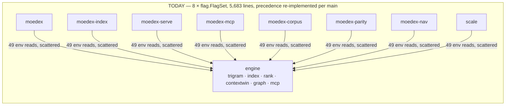
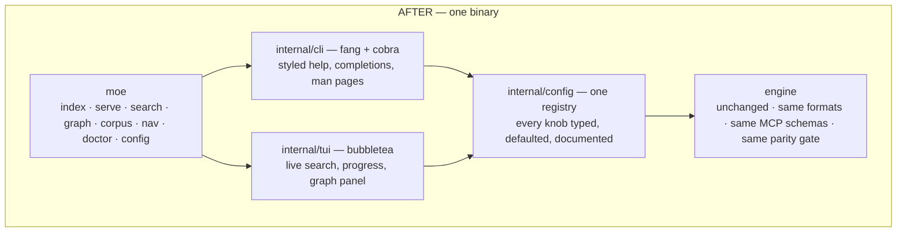
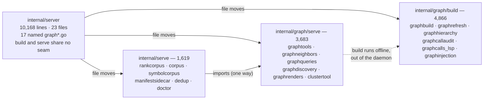

# Eight binaries to one — shell rearchitecture under Moe

**Status:** Proposed · **Drafted:** 2026-08-26 · **Baseline:** HEAD `7eae873`
**Companion artifact:** <https://claude.ai/code/artifact/e9955128-6793-408f-9c7c-1f447f74f313>

> The engine is the good part. Keep all of it. Replace the shell it lives in — eight
> flag-parsing mains, forty-nine environment variables, and no interface a human would
> choose to use.

| | |
|---|---|
| Engine, ported intact | ~30,700 lines |
| Shell, rewritten | 5,683 lines |
| `internal/server`, split | 10,168 lines → 3 packages |
| Estimated focused work | 3–4 weeks |

---

## 1. The read

moedex indexes 491 repositories and 63,523 files in 59 seconds, holds ripgrep parity on
every query, and serves ranked, token-budgeted context over MCP. Almost every complaint in
its own `CONCERNS.md` is about the layer above that.

### Untouched — this is why the tool exists

- **Positional trigram core.** Cox reduction, byte offsets, verify prefilter. Parity-gated
  against ripgrep on a full corpus, every push.
- **Content-addressed storage.** Git blob SHA as identity, corpus-wide dedup, per-blob delta
  refresh, mmap'd postings off the Go heap.
- **Four-arm RRF ranking.** Lexical, path, symbol, dense — plus the context-window assembler
  that packs blocks under a token budget deterministically.
- **Graph layer.** Four provenance-backed confidence tiers with dereferenceable evidence
  spans. Nobody else's code graph tells you *why* it believes an edge.
- **The parity harness.** 3,121 lines that make a port this size safe. It is the acceptance
  gate, not a test suite.

### Replaced — none of this is the engine

- **Eight binaries, eight flag parsers.** 5,683 lines of `flag.FlagSet` wiring with
  hand-rolled precedence logic repeated per main.
- **Forty-nine `MOEDEX_*` variables.** Twenty-four documented anywhere. A typo is
  indistinguishable from leaving it unset.
- **A 10,168-line serving package** that owns the entire graph layer — build, refresh, query,
  render — with no compiler-enforced seam.
- **No interface.** A 59-second corpus build prints nothing. Search returns `path:line`. The
  richest context assembler in the stack has no way to look at its own output.
- **Heroic install hacks.** `make install` refuses a dirty tree and deletes `GOPATH/bin`
  shadows — scar tissue from a real index-loss incident, papering over distribution.

---

## 2. The shape — one front door, one config path





Green is what does not change. The rewrite is entirely above it.

---

## 3. The one structural change — splitting the serving package

This is not a new idea. `CONCERNS.md` proposes it and then defers it: *"do this after the
graph layer's churn rate drops."* The churn has not dropped, and it will not. A
reimplementation **is** the split moment — the plan sequences graph **last** so the rest of
the port isn't chasing it.



`4,866 + 3,683 + 1,619 = 10,168`. No logic is rewritten in this phase — only homes reassigned
and imports fixed, so the diff is reviewable as a pure move.

The payoff is a compiler-enforced seam: graph construction becomes testable without standing
up a server, and the daemon stops compiling the entire build pipeline it never calls.

---

## 4. Sequence — ordered by churn, not by layer

Eight of the last eleven commits touched the graph layer. Port the stable packages first and
let the moving target settle.

### The gate (applies to every phase)

`make verify` — build, vet, full unit suite, persistence round trips, and full-corpus parity
against ripgrep — passes on the same corpus with **byte-identical results**. A phase that
cannot say that is not done.

| Phase | Work | Estimate |
|---|---|---|
| P0 | Hygiene and fences | 1 day |
| P1 | Kernel port | 1 day |
| P2 | One binary, fang front door | 2 days |
| P3 | Config registry | 2 days |
| P4 | Make the machine visible | 1–2 days |
| P5 | The TUI | 4–5 days |
| P6 | Split the serving package | 2–3 days |
| P7 | Deployment migration | 1 day |
| P8 | *Optional* — `moe ask` | 2–3 days |

**P0 — Hygiene and fences, before anything moves.** Run `gofmt -w` as one isolated commit
(27 files drifted) and add `gofmt -l` to `make health`. Add a CI job running `vet-lsp` and
`build-dense` so the 37 build-tagged files stop rotting invisibly. Add the import fence that
will hold the new invariant.

**P1 — Kernel port, mechanical and verifiable.** Move 20 stable packages under
`internal/engine/`. Import-path rewrite only, no logic touched. Land it as one commit whose
diff is provably nothing but `package` and `import` lines, then run the gate.

**P2 — One binary, fang front door.** Collapse eight mains into `moe <verb>`. Fang supplies
styled help, shell completions, man pages, version, and formatted errors for free. Every
existing flag keeps its spelling; old names stay reachable through shims.

**P3 — Config registry, killing the 49-variable sprawl.** One declaration site per knob:
type, default, doc string, which commands read it. `moe config` prints every setting, its
effective value, and *where that value came from*. An unregistered `MOEDEX_*` in the
environment warns loudly instead of being silently ignored. The README's operator table is
generated from it.

**P4 — Make the machine visible.** Charm's `log/v2` replaces ad-hoc log lines; `colorprofile`
degrades to plain text in CI with no flag. Index builds emit a real progress model — repos,
blobs, sidecars, graph passes — and `--json` emits the same event stream for scripts.
`moe doctor` becomes a styled preflight over the existing `doctor.go` logic.

**P5 — The TUI, the part that earns the stack.** Bare `moe` opens a live search over the warm
corpus: type, see ranked context blocks with their scores, tab into graph neighbors,
<kbd>ctrl+y</kbd> to yank the assembled window as markdown straight into an agent prompt.
Glamour renders it; lipgloss themes it; the context assembler finally has a face.

**P6 — Split the serving package.** The move described above. Do it here, after the shell has
stopped changing and the graph layer has had five phases to settle. Add the paired-path
regression test `CONCERNS.md` asks for: run the full build and the incremental refresh,
compare edge sets.

**P7 — Deployment migration.** Eight binaries appear in launchd plists, systemd units and
timers, two Dockerfiles, and `install-macos.sh`. Ship `moe` plus `moedex-*` compat symlinks
that dispatch on `argv[0]`, update the unit files, and keep the shims for one release so an
in-place upgrade cannot strand a running daemon.

**P8 — Optional: `moe ask`.** Fantasy plus Catwalk give provider-agnostic models and a live
catalog. moedex already builds the ideal prompt: a ranked, deduplicated, token-budgeted
context window with citations. `moe ask "where does settlement post to the ledger"` is a thin
layer on top. The same machinery gives `internal/eval` an LLM judge to widen gold coverage —
worth doing, since the Verified-precision floor currently rests on about nine labelled edges.

---

## 5. What golden DX looks like

```console
$ moe config --diff
  49 settings registered · 6 set · showing non-default only

  MOEDEX_INDEX_DIR        /var/lib/moe/index        flag  -index-dir
  MOEDEX_MCP_HTTP_ADDR    127.0.0.1:8081            file  /etc/moe/moe.env:4
  MOEDEX_AUTH_TOKEN       ••••••••                  file  /etc/moe/moe.env:9
  MOEDEX_SEARCH_MAX_CONC  16                        env

  !  MOEDEX_MCP_CONCURENCY=8 is set but not a registered setting.
     Closest match: MOEDEX_MCP_MAX_CONCURRENCY. Ignoring it.

$ moe index build --corpus ~/.moe-managed
  > discover   491 repos, 63,523 eligible files          1.2s
  > ingest     ####################........  52,104/63,523   18.4s
  > sidecars   tokens · symbols · paths
  > graph      candidates 1.4M -> 240k verified edges     31.9s
             peak rss 8.6 GB · 6 shards · publishing generation 41

$ moe doctor
  ok  corpus        491 repos, locked, 3 behind origin
  ok  snapshot      generation 41, published 14:10, CURRENT resolves
  ok  daemon        com.moe.serve up 6d, 8081 loopback, token 0600
  !   ripgrep       not on PATH — parity tests will skip
  !   onnx runtime  unset — dense arm off, lexical/path/symbol unaffected
      ONNXRUNTIME_LIB_PATH is where I'd look first.
```

Three things are doing the work and none of them are decoration: the config command names its
own source of truth, the build stops being a silent minute, and the doctor distinguishes
broken from merely absent. The voice — flat, specific, no apologies, one suggestion where a
suggestion helps — is the same in all three.

---

## 6. The port table

Line counts are measured. Destinations are drawn from the documented one-way dependency
direction in `ARCHITECTURE.md` and the file inventory in `CONCERNS.md` — the package map and
exported surfaces were read, most function bodies were not. Treat **verbatim** as a strong
prior to be confirmed by the gate, not as an audit result.

Legend: **verbatim** = import rewrite only · **file move** = new package, same code ·
**rewrite** · **new**

### Kernel — the reason to keep the project

| Package today | Lines | Destination | Disposition | Note |
|---|---:|---|---|---|
| `internal/parity` | 3,121 | `engine/parity` | verbatim | Port this **first**. It is the gate every later phase is judged by. |
| `internal/blobstore` | 2,755 | `engine/blobstore` | verbatim | Best-covered package in the repo (2.14 test ratio) with crash-recovery gates. Do not touch. |
| `internal/symbol` | 2,550 | `engine/symbol` | verbatim | Sidecar codec is a frozen on-disk format. `ExtractorsVersion` stays put. |
| `internal/eval` | 2,544 | `engine/eval` | verbatim | LLM-judge arm lands in P8, additively, behind the same runner. |
| `internal/diskstore` | 1,961 | `engine/diskstore` | verbatim | Owns `MOEDEX03` and `MOECONT1`. Existing shard dirs must keep loading. |
| `internal/embed` | 1,958 | `engine/embed` | verbatim | `onnx`-tagged. Add the missing rationale comment beside the tokenizer `replace`. |
| `internal/rank` | 1,504 | `engine/rank` | verbatim | RRF weights and arm gates are load-bearing on eval scores. Change nothing here in a port. |
| `internal/search` | 1,117 | `engine/search` | verbatim | Ripgrep parity lives or dies here. |
| `internal/snapshot` | 918 | `engine/snapshot` | verbatim | One exception: `lock_other.go` needs PID + staleness recovery before any non-Unix target. |
| `internal/query` | 814 | `engine/query` | verbatim | Cox reduction. Must stay a necessary condition, never an under-approximation. |
| `internal/contextwin` | 770 | `engine/contextwin` | verbatim | Deterministic packing order is contract, not implementation detail. The TUI renders its output. |
| `internal/index` | 770 | `engine/index` | verbatim | Fix `ftoa` in `selector.go:81` while passing through — cosmetic, open since the audit. |
| `internal/ingest` | 734 | `engine/ingest` | verbatim | The AI-privacy boundary. Preserve the exec-free `catalog` seam exactly. |
| `internal/classify` | 598 | `engine/classify` | verbatim | 598 tested lines no production path calls. Wire the promotion pass into the build in P6. |
| `internal/tokenindex` | 502 | `engine/tokenindex` | verbatim | `Tokenize` is explicitly frozen — changing it invalidates every persisted BM25 stat. |
| `internal/fmindex` | 315 | `engine/fmindex` | verbatim | — |
| `internal/setops` | 297 | `engine/setops` | verbatim | SIMD arm measured a null result. Keep as a documented experiment; let it break loudly. |
| `internal/version` | 294 | `engine/version` | verbatim | Source-digest stamping survives; `moe version` replaces eight `-version` flags. |
| `internal/fold` | 30 | `engine/fold` | verbatim | Shared by query and search so both agree on every rune. Keep them sharing it. |
| `internal/trigram` | 19 | `engine/trigram` | verbatim | Nineteen lines the entire product rests on. |

### Graph — ports intact, then absorbs the split

| Package today | Lines | Destination | Disposition | Note |
|---|---:|---|---|---|
| `internal/graph/httproute` | 2,177 | `engine/graph/httproute` | verbatim | 0.29 test ratio, never independently reviewed. Port as-is; add tests before trusting route edges. |
| `internal/graph/manifest` | 1,748 | `engine/graph/manifest` | verbatim | — |
| `internal/graph/diskgraph` | 1,112 | `engine/graph/diskgraph` | verbatim | v2 edge records are a frozen format. Keep the count-vs-remaining-bytes bounds check verbatim. |
| `internal/graph/candidates` | 964 | `engine/graph/candidates` | verbatim | The recall half of graph construction. Read only as a dependency, never audited. |
| `internal/graph/verify` | 483 | `engine/graph/verify` | verbatim | The precision half. Same caveat. |
| `internal/graph/cluster` | 406 | `engine/graph/cluster` | verbatim | — |

### The split — same code, three homes (P6)

| Files today | Lines | Destination | Disposition | Note |
|---|---:|---|---|---|
| `server/graph*.go` *(build side)* | 4,866 | `engine/graph/build` | file move | graphbuild, graphrefresh, graphhierarchy, graphcallaudit, graphcalls_lsp, graphinjection, similar arms. |
| `server/graph*.go` *(query side)* | 3,683 | `engine/graph/serve` | file move | graphtools, graphneighbors, graphqueries, graphdiscovery, graphrenders, clustertool, httpgraph. |
| `internal/server` *(remainder)* | 1,619 | `internal/serve` | file move | rankcorpus, corpus, symbolcorpus, manifestsidecar, dedup, doctor. Fix `rootsForFile` to consult `byPath`. |

### Boundary packages — port, but with work attached

| Package today | Lines | Destination | Disposition | Note |
|---|---:|---|---|---|
| `internal/navigate` | 3,032 | `engine/navigate` | verbatim | `lsp`-tagged. Make `HashFiles` refuse paths outside the privacy-approved set instead of trusting the caller. |
| `internal/corpus` + `catalog` | 3,352 | `internal/corpus` | verbatim | Stays out of `engine/` by design — it is the only package that shells out. `catalog` has zero tests and is on the engine path; write them. |
| `internal/mcp` | 1,734 | `internal/mcp` | verbatim | Tool schemas are the hardest contract in the repo. `contract_test.go` is the upgrade gate — keep it comprehensive. |

### The shell — rewritten and new

| Package today | Lines | Destination | Disposition | Note |
|---|---:|---|---|---|
| `cmd/` × 8 | 5,683 | `internal/cli` | rewrite | Eight `flag.FlagSet` blocks become one cobra tree under fang. Flag spellings preserved; `argv[0]` shims keep old names working. |
| `serve/config.go` | ~430 | `internal/config` | rewrite | Its precedence rule — flag > file > env > default — is *correct* and becomes the registry's rule. Only the plumbing is thrown away. |
| — | — | `internal/config/registry` | new | One declaration per knob. Generates the operator table; warns on unknown `MOEDEX_*`; powers `moe config`. |
| — | — | `internal/tui` | new | Bubbletea v2 + bubbles. Live search, build progress, graph-neighbor panel, yank-to-agent. |
| — | — | `internal/ui/theme` | new | Lipgloss v2 tokens plus colorprofile degradation. One place that knows what Moe looks like. |
| — | — | `internal/render` | new | Glamour v2. Context windows, ADRs, and parity reports render the same way everywhere. |

---

## 7. Frozen — what must survive untouched

The primary consumer of this tool is not a person. It is an agent holding an MCP connection,
and a daemon holding a mapped shard directory. Human DX is the point of the rewrite; these are
the things it is not allowed to cost.

| Contract | Requirement |
|---|---|
| **MCP tool schemas** | Every tool name, input schema, and result shape. `internal/mcp/contract_test.go` (376 lines) already pins these against the SDK's own types — it is the existing gate and needs no invention, only respect. |
| **On-disk formats** | `MOEDEX03` postings, the deduped `MOEDEX05` served format, `MOECONT1` content store, graph v2 adjacency, symbol sidecar codec. If these port byte-for-byte, an existing 2.6 GB shard directory and its published generations keep working across the upgrade — the cheapest and most persuasive property this plan has. |
| **HTTP surface** | `/search`, `/stats`, `/mcp`, their auth behavior, and the constant-time token comparison. One deliberate break: a non-loopback bind with no token becomes a fatal startup error with an explicit `--allow-insecure` escape, instead of a warning nobody reads. |
| **Ranking behavior** | RRF weights, arm coverage thresholds, the dense query-length gate, and the context assembler's packing order. A port must not move an eval number. If one moves, the port broke something. |
| **The privacy boundary** | `.ai-privacy.yml` fails closed, level-1 paths never open, `internal/corpus/catalog` stays exec-free. Nothing in CI enforces that last property today; the new import fence can. |

---

## 8. Decisions this plan assumes

**D1 — Is it still called moedex?**
`moe` is three characters, matches the mascot, and reads correctly as a verb-first CLI:
`moe search`, `moe doctor`. Keeping `moedex` costs nothing technically and preserves every
muscle-memory path, script, and unit file.
*Recommendation:* **moe**, with `moedex-*` shims kept for one release. The rename is the
cheapest signal that the interface actually changed.

**D2 — What replaces the "pure Go" invariant?**
It is already false — the MCP SDK pulls oauth2, jsonschema-go, and hand-written assembly into
the default build with no build tag. Adding the Charm stack does not break the rule so much as
finish breaking it.
*Recommendation:* **"the engine has zero third-party dependencies,"** fenced in CI by
`go list -deps ./internal/engine/...` failing on any non-stdlib import. A rule a machine checks
beats a rule a doc asserts.

**D3 — How far does the Charm stack go?**
Bubbletea, lipgloss, bubbles, glamour, log, colorprofile, and fang are shell dependencies and
land in P2–P5. Fantasy and Catwalk are different in kind — they make a search engine into an
LLM client, with the dependency weight and the API-key surface that implies.
*Recommendation:* **shell stack now; `moe ask` as a separate module in P8**, so a corpus
operator who wants none of it compiles none of it.

---

## 9. Known costs

**Young dependencies under a stable service.** Bubbletea and lipgloss are freshly on v2, the
modules just moved to `charm.land` paths, and `ultraviolet` carries no release tag at all. A
context service's value is that it is boring and up. Pin every Charm version explicitly and
upgrade on purpose — do not track.

**Windows moves further away, not closer.** The Charm stack is genuinely cross-platform; the
engine is not. `syscall.Mmap` in `diskstore` and `diskgraph` is still the hard compile blocker,
and this plan does not touch it. A polished TUI that cannot run on Windows is a mismatch worth
naming out loud rather than discovering later.

**A big diff over thin test coverage.** `internal/graph/httproute` sits at 0.29,
`internal/snapshot` at 0.25, and `internal/corpus/catalog` has no tests at all. The parity gate
covers retrieval correctness thoroughly and these packages barely at all. Write tests for those
three **before** P6 moves anything near them.

**The eleven commits still landing.** The graph layer is under active construction — a 639-line
file appeared in the most recent commit. Every phase here rebases against that. Sequencing
graph last is the mitigation; a merge freeze on `internal/server` during P6 is the other half.

---

## Sources

ARCHITECTURE.md · CONCERNS.md · STACK.md · README.md · Makefile · go.mod · package and file
inventories under `cmd/` and `internal/`.

Line counts measured 2026-08-26 against HEAD `7eae873`. Reference libraries surveyed at
bubbletea v2.0.9 · lipgloss v2.0.6 · bubbles v2.2.1 · glamour v2.0.1 · fang v2.0.1 ·
log v2.0.0 · fantasy v0.41.3 · catwalk v0.52.12 · crush v0.91.2 · ultraviolet untagged.
